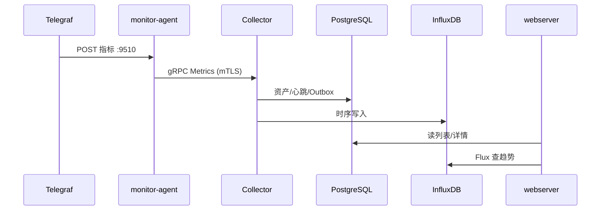

# Meerkat服务器集群实时监控平台


<div align="center">

  

  “meerkat”在中文中通常翻译为猫鼬或狐獴，属于獴科的一种小型食肉哺乳动物，原产于非洲南部,它们喜欢群居生活，跟小伙伴在一起的时候，总有一个专职“站岗放哨”的哨兵，发现危险后，通过不同频率组合的叫声传递超过20种信息，精准指示天敌类型(如鹰隼、狐狸)和方位，让其它小伙伴及时警觉危险。Meerkat服务器集群实时监控平台的寓意也是像狐獴一样，及早发现服务器的状态异常，及时预警。
</div>


面向内网服务器集群的统一监控：被监控机采集指标，中心机汇聚、存储与展示。**指标不经 Telegraf 直写 InfluxDB**，经 **monitor-agent** 用 **mTLS gRPC** 上报到 **Collector**。

本仓库是**源码 + 本机开发运行包**的合集（多个 Go module），**未使用 Docker**。第三方组件用系统安装包或工作区已解压的二进制；Windows / Linux 均提供一键脚本（见 [§8](#8-一键脚本总览)）。

---

## 目录

1. [项目概况](#1-项目概况)
2. [架构与数据流](#2-架构与数据流)
3. [技术栈（按端）](#3-技术栈按端)
4. [需要安装的软件（Agent 端 vs 中心端）](#4-需要安装的软件agent-端-vs-中心端)
5. [仓库目录](#5-仓库目录)
6. [编译（Windows / Linux，amd64 / arm64）](#6-编译windows--linuxamd64--arm64)
7. [部署与必改配置](#7-部署与必改配置)
8. [一键脚本总览](#8-一键脚本总览)
9. [Windows 操作手册](#9-windows-操作手册)
10. [Linux 操作手册（Ubuntu / Debian 系）](#10-linux-操作手册ubuntu--debian-系)
11. [健康检查：端口、进程、HTTP](#11-健康检查端口进程http)
12. [证书（mTLS）](#12-证书mtls)
13. [配置文件索引](#13-配置文件索引)
14. [安全与更多文档](#14-安全与更多文档)

---

## 1. 项目概况

| 概念 | 说明 |
| --- | --- |
| **用途** | 多机 CPU / 内存 / 磁盘 / 网络 / 进程等指标采集；中心控制台查看列表、详情、趋势与告警状态 |
| **规划网段** | 被监控机 `192.168.1.1`～`192.168.1.99`，中心机 `192.168.1.100`（本机开发可全部 `localhost`） |
| **被监控机** | **Telegraf** 采集 → **monitor-agent** 接收、缓存、上报 |
| **中心机** | **Collector** 接入 Agent；**PostgreSQL** 存资产/心跳/告警；**InfluxDB** 存时序；**webserver + Vue** 提供登录与 API |

| 角色 | 源码目录 | 典型产物 / 运行目录 |
| --- | --- | --- |
| 采集器 | `Telegraf/` | `Telegraf/telegraf.exe` 或系统 `telegraf` |
| Agent | `client/` | `client/monitor-agent.exe` 或 `dist/linux-*/monitor-agent` |
| Collector | `server/` | `server/collector.exe` 或 `dist/linux-*/collector` |
| Web API | `webserver/` | `webserver/webserver.exe` 或 `dist/linux-*/webserver` |
| 控制台 | `web/` | 开发 `pnpm dev`（:3000）；生产 `web/dist` + Nginx |

协议源文件唯一：`server/api/proto/collector/v1/collector.proto`。修改后需 `protoc` 重新生成并**同时**重启 Agent 与 Collector。

---

## 2. 架构与数据流

### 2.1 部署视图

```text
                         中心机
┌────────────────────────────────────────────────────────────┐
│  浏览器 :3000 ──► Vue（/dev-api 代理到 webserver :8090）    │
│  webserver :8090 ──读──► PostgreSQL :5432、InfluxDB :8086   │
│  Collector :9500 (mTLS gRPC) ──写──► PG + InfluxDB         │
│  Collector 管理 HTTPS :8080（自签 CA）                        │
└────────────────────────────┬───────────────────────────────┘
                             │ gRPC + mTLS
        ┌────────────────────┼────────────────────┐
        ▼                    ▼                    ▼
   被监控机 A            被监控机 B            被监控机 N
   Telegraf → :9510      同左                  同左
   monitor-agent         monitor-agent         monitor-agent
   health :9511           health :9511          health :9511
```

### 2.2 关键访问关系

| 从 | 到 | 地址 / 说明 |
| --- | --- | --- |
| Telegraf | 本机 Agent | `http://127.0.0.1:9510/v1/telegraf/metrics`（仅回环，成功 `204`） |
| Agent | Collector | `server_address`，如 `192.168.1.100:9500`，mTLS |
| Collector / webserver | PostgreSQL | 默认 `localhost:5432` |
| Collector / webserver | InfluxDB | 默认 `http://localhost:8086`，org `hkc`，bucket `bucket` |
| Vue 开发 | webserver | `web/.env.development` → `VITE_APP_API_URL=http://localhost:8090` |

跨机部署时：Agent 的 `server_address` 改为中心 IP/域名；**服务端证书 SAN 须包含该地址**。Telegraf 输出 URL **始终本机 9510**，不要写成中心地址。

### 2.3 时序（简图）



---

## 3. 技术栈（按端）

### 3.1 自研程序（Go / 前端）

| 组件 | 技术 | 说明 |
| --- | --- | --- |
| monitor-agent | Go **1.27+**，`CGO_ENABLED=0` | gRPC 客户端、SQLite 积压、HTTP 收 Telegraf |
| collector | Go 1.27+ | gRPC 服务端、GORM、Influx 写入、Outbox |
| webserver | Go 1.27+，Gin、JWT | 登录/菜单/监控 API；会话 SQLite |
| 控制台 | Vue **3**、Vite、TypeScript、Element Plus、ECharts、**pnpm** | 仅中心机需要（开发或构建静态资源） |
| RPC | gRPC + Protobuf | `protoc` 31+ 推荐；插件 `protoc-gen-go` / `protoc-gen-go-grpc` |
| 传输安全 | mTLS | 测试证书：`client/cmd/certgen` 或 `scripts/cert/Generate-mTLSCerts.ps1` |

### 3.2 第三方（按机器角色）

见下一节「安装清单」。Agent 端**不需要** PostgreSQL / InfluxDB / Collector / webserver。

---

## 4. 需要安装的软件（Agent 端 vs 中心端）

### 4.1 被监控机（Agent 主机）

| 软件 | 版本（本仓库验证） | 是否必须 | 官方站点 |
| --- | --- | --- | --- |
| **monitor-agent** | 自编译 | 必须 | 本仓库 `client/` |
| **Telegraf** | **1.40+**（工作区自带 1.40.1） | 必须 | https://www.influxdata.com/time-series-platform/telegraf |
| **Go** | **1.27+** | 仅编译机需要 | https://go.dev/dl/ |
| MySQL / Redis / PostgreSQL 等 | 视 `telegraf.conf` 插件 | 可选采集目标 | 各上游官网 |

**不需要**：InfluxDB、PostgreSQL、Collector、webserver、Node.js。

### 4.2 中心机（Server 主机）

| 软件 | 版本（本仓库验证） | 是否必须 | 官方站点 |
| --- | --- | --- | --- |
| **PostgreSQL** | **16+** 推荐 | 必须 | https://www.postgresql.org/download/ |
| **InfluxDB** | **2.x** | 必须 | https://docs.influxdata.com/influxdb/v2/ |
| **collector** / **webserver** | 自编译 | 必须 | 本仓库 `server/`、`webserver/` |
| **Go** | 1.27+ | 仅编译机需要 | https://go.dev/dl/ |
| **Node.js LTS** + **pnpm** | LTS + 9.x 常见 | 开发控制台必须；生产可只部署 `web/dist` | https://nodejs.org/ https://pnpm.io/ |
| **protoc** | 31+（改 proto 时） | 开发 | https://github.com/protocolbuffers/protobuf/releases |

**不需要**：在被监控机上安装 Telegraf 以外的中心组件。

### 4.3 工作区自带（Windows 开发包，可选）

| 内容 | 路径 |
| --- | --- |
| protoc | `protoc64/bin/protoc.exe` |
| InfluxDB 2 Windows 二进制 | `influxdb2/influxdb2_windows_amd64/influxd.exe` |
| Telegraf Windows 二进制 | `Telegraf/telegraf.exe` |

> **InfluxDB 启动**：`setup-windows.ps1` / `setup-linux.sh` **均不**自动拉起 InfluxDB；请用 `scripts/windows/server/start.ps1` 或 `scripts/linux/server/start.sh`。Windows 上 `start.ps1` 使用 `%USERPROFILE%\.influxdbv2`（避免与工作区错误 bolt 路径冲突）。

---

## 5. 仓库目录

```text
monitor/
├── client/              Agent、certgen
├── server/              Collector
├── webserver/           监控后台 HTTP API
├── web/                 Vue 控制台
├── Monitor/             Windows Agent 运行目录（exe、config、certs、state）
├── Telegraf/            Telegraf 发行包与 telegraf.conf
├── influxdb2/           InfluxDB 2 Windows 发行包（可选）
├── protoc64/            protoc（可选）
├── scripts/             setup、windows/*、linux/*、cert/*
├── dist/                交叉编译输出 linux-amd64 / linux-arm64
└── doc/                 补充备忘
```

---

## 6. 编译（Windows / Linux，amd64 / arm64）

统一要求：`CGO_ENABLED=0`（Agent / Collector / webserver 均不依赖 CGO）。

### 6.1 Windows 本机（amd64）

在**包根目录**执行，或先 `cd` 到对应子目录：

```powershell
$root = "C:\Users\Administrator\Desktop\monitor"   # 改成你的路径
$env:CGO_ENABLED = "0"

Set-Location "$root\client"
go test ./...
go build -trimpath -ldflags "-s -w" -o "$root\client\monitor-agent.exe" .\cmd\monitor-agent

Set-Location "$root\server"
go build -trimpath -ldflags "-s -w" -o "$root\server\collector.exe" .\cmd\collector

Set-Location "$root\webserver"
go build -trimpath -ldflags "-s -w" -o "$root\webserver\webserver.exe" .\cmd\webserver
```

也可运行 `powershell -File .\scripts\setup-windows.ps1`（含 `web\` 下 `pnpm install`、证书、编译）。参数：`-SkipInstall`、`-BuildOnly`。

### 6.2 Linux 本机（amd64 / arm64）

```bash
ROOT=/opt/monitor   # 改成你的路径
export CGO_ENABLED=0

cd "$ROOT/client"  && go build -trimpath -ldflags "-s -w" -o "$ROOT/dist/linux-amd64/monitor-agent" ./cmd/monitor-agent
cd "$ROOT/server"  && go build -trimpath -ldflags "-s -w" -o "$ROOT/dist/linux-amd64/collector" ./cmd/collector
cd "$ROOT/webserver" && go build -trimpath -ldflags "-s -w" -o "$ROOT/dist/linux-amd64/webserver" ./cmd/webserver
```

本机为 **arm64** 时，把输出目录改为 `dist/linux-arm64`（或在 arm64 机器上直接编译到该目录）。

`./scripts/setup-linux.sh` 从 [go.dev](https://go.dev/dl/) 安装 **Go 1.27.1** 到 `/usr/local/go`（不用 apt 的旧版 `golang-go`），按本机架构编译到 `dist/linux-amd64/` 或 `dist/linux-arm64/`。环境变量写入 `scripts/linux/monitor.env` 与 `/etc/monitor/monitor.env`，执行前：

```bash
set -a && source /etc/monitor/monitor.env && set +a
# 或 source /path/to/monitor/scripts/linux/monitor.env
```

可选 `GO_VERSION=1.27.1`、`GO_INSTALL_DIR=/usr/local/go`。Go 的 `PATH` 会写入 `/etc/profile.d/monitor-go.sh`，并在 `/etc/bash.bashrc` 中 `source`（login 与面板终端均可用）。业务变量见 `/etc/monitor/monitor.env`；可选 `MONITOR_ENV_AUTO=1` 在登录时一并加载（`/etc/profile.d/monitor-env.sh`）。示例见 `scripts/linux/monitor.env.example`。

### 6.3 交叉编译（在 Windows 上出 Linux 包）

```powershell
$root = "C:\Users\Administrator\Desktop\monitor"
New-Item -ItemType Directory -Force "$root\dist\linux-amd64","$root\dist\linux-arm64" | Out-Null
$env:CGO_ENABLED = "0"

# amd64
$env:GOOS = "linux"; $env:GOARCH = "amd64"
go build -C "$root\client" -trimpath -ldflags "-s -w" -o "$root\dist\linux-amd64\monitor-agent" ./cmd/monitor-agent
go build -C "$root\server" -trimpath -ldflags "-s -w" -o "$root\dist\linux-amd64\collector" ./cmd/collector
go build -C "$root\webserver" -trimpath -ldflags "-s -w" -o "$root\dist\linux-amd64\webserver" ./cmd/webserver

# arm64
$env:GOARCH = "arm64"
go build -C "$root\client" -trimpath -ldflags "-s -w" -o "$root\dist\linux-arm64\monitor-agent" ./cmd/monitor-agent
go build -C "$root\server" -trimpath -ldflags "-s -w" -o "$root\dist\linux-arm64\collector" ./cmd/collector
go build -C "$root\webserver" -trimpath -ldflags "-s -w" -o "$root\dist\linux-arm64\webserver" ./cmd/webserver

Remove-Item Env:GOOS, Env:GOARCH, Env:CGO_ENABLED -ErrorAction SilentlyContinue
```

### 6.4 前端

```powershell
Set-Location C:\Users\Administrator\Desktop\monitor\web
pnpm install
pnpm build          # 生产静态资源 → web/dist
pnpm dev            # 开发 :3000
```

---

## 7. 部署与必改配置

### 7.1 启动顺序（逻辑依赖）

```text
中心：PostgreSQL → InfluxDB（初始化 org/bucket/token）→ Collector → webserver →（仅 Windows 开发机）`pnpm dev`；Linux 中心机用 `pnpm build` + Nginx 或本机手动 `pnpm dev`
被监控：monitor-agent → Telegraf
```

### 7.2 中心机必改/必核对

| 文件 | 改什么 |
| --- | --- |
| `server/configs/server.local.yaml` | `postgres.*`、`influx.url/token/org/bucket`、`tls` 证书路径、`grpc_address` |
| `webserver/configs/webserver.yaml` | 同上 PG/Influx；`jwt.secret`；`http_address`（默认 `:8090`） |
| 环境变量（推荐生产） | `MONITOR_INFLUX_TOKEN`、`WEBSERVER_JWT_SECRET`、`WEBSERVER_ADMIN_PASSWORD`、`MONITOR_POSTGRES_PASSWORD` |

Influx 首次初始化：浏览器打开 `http://<中心>:8086`，**org=`hkc`**，**bucket=`bucket`**，创建 **write** Token 写入 yaml 或环境变量。

### 7.3 被监控机必改/必核对

| 文件 | 改什么 |
| --- | --- |
| `client/configs/agent.yaml`（或 `/etc/monitor-agent/agent.yaml`） | **`agent_id` 全局唯一**；`server_address` 为中心 `IP:9500`；`ca_file` / `cert_file` / `key_file` |
| `Telegraf/telegraf.conf` | 输出 URL 保持 `http://127.0.0.1:9510/v1/telegraf/metrics`；标签环境变量与 Agent 一致 |
| 证书 | 各机复制同一套 **`ca.pem` + `client.pem` + `client-key.pem`**（测试环境共用一张 client 证即可） |

### 7.4 Linux 中心机文件落位示例

```bash
sudo install -Dm755 collector /usr/local/bin/monitor-collector
sudo install -Dm755 webserver /usr/local/bin/monitor-webserver
sudo install -Dm600 server.local.yaml /etc/monitor-server/server.yaml
sudo install -Dm600 webserver.yaml /etc/monitor-webserver/webserver.yaml
sudo install -Dm600 ca.pem server.pem server-key.pem /etc/monitor-server/certs/
```

webserver 工作目录需可写 `data/webserver.db`（SQLite）。

### 7.5 Linux 被监控机示例

```bash
sudo install -Dm755 monitor-agent /usr/local/bin/monitor-agent
sudo install -Dm600 agent.yaml /etc/monitor-agent/agent.yaml
sudo install -Dm600 ca.pem client.pem client-key.pem /etc/monitor-agent/certs/
# systemd: client/packaging/monitor-agent.service
```

---

## 8. 一键脚本总览

脚本从自身路径**上溯三层**定位包根目录，路径与绝对安装位置无关。

| 脚本 | 平台 | 作用 |
| --- | --- | --- |
| `scripts/setup-windows.ps1` | Windows | 检查/安装依赖、`web` 的 `pnpm install`、生成证书、编译三端；**不启动 InfluxDB** |
| `scripts/windows/server/start.ps1` | Windows | PG 检查、**重启 Influx**（`.influxdbv2`）、Collector、webserver、**pnpm dev + 打开浏览器** |
| `scripts/windows/server/stop.ps1` | Windows | 停前端 :3000、collector、webserver、Influx；`-Infra` 另停 PostgreSQL |
| `scripts/windows/agent/start.ps1` | Windows | monitor-agent + Telegraf（可见控制台） |
| `scripts/windows/agent/stop.ps1` | Windows | telegraf + monitor-agent |
| `scripts/cert/Generate-mTLSCerts.ps1` | Windows | 默认 Go certgen → `client/certs` |
| `scripts/setup-linux.sh` | Linux | 安装 **Go 1.27.1**、写 `monitor.env`、apt 装 PG/Influx/Telegraf（可跳过）、编译到 `dist/linux-*`；**不启动 InfluxDB** |
| `scripts/linux/server/start.sh` | Linux | PG、Influx、Collector、webserver；**不启动** `pnpm dev` |
| `scripts/linux/server/stop.sh` | Linux | 停中心进程；`INFRA=1` 停 PostgreSQL |
| `scripts/linux/agent/start.sh` | Linux | agent + telegraf |
| `scripts/linux/agent/stop.sh` | Linux | agent + telegraf |

---

## 9. Windows 操作手册

### 9.1 首次准备

```powershell
cd C:\Users\Administrator\Desktop\monitor
powershell -ExecutionPolicy Bypass -File .\scripts\setup-windows.ps1
```

### 9.2 启动 / 停止

```powershell
# 中心机（本机可同时当中心）
powershell -File .\scripts\windows\server\start.ps1

# 被监控机（或本机第二套 Agent）
powershell -File .\scripts\windows\agent\start.ps1

# 停止
powershell -File .\scripts\windows\server\stop.ps1
powershell -File .\scripts\windows\agent\stop.ps1
# powershell -File .\scripts\windows\server\stop.ps1 -Infra   # 含 PostgreSQL
```

`start.ps1` 未设置 `WEBSERVER_ADMIN_PASSWORD` 时默认 `Monitor123!`；首次 SQLite 无用户时会创建 **admin**。

### 9.3 手动启动（排障用）

见 `doc/windows-local-startup.md`；核心端口见 [§11](#11-健康检查端口进程http)。

---

## 10. Linux 操作手册（Ubuntu / Debian 系）

### 10.1 首次准备

```bash
cd /path/to/monitor
chmod +x scripts/setup-linux.sh scripts/linux/**/*.sh
./scripts/setup-linux.sh
# 可选：SKIP_INSTALL=1 ./scripts/setup-linux.sh
```

`setup-linux.sh` 会尝试拉起 PostgreSQL（若已装但未监听），**不会**启动 InfluxDB；Influx 由下一节的 `server/start.sh` 负责。Go 的 PATH 安装后对新终端自动生效；当前 shell 可 `source /etc/profile.d/monitor-go.sh`。启服务前再 `source /etc/monitor/monitor.env` 以加载 `MONITOR_ROOT`、`MONITOR_INFLUX_TOKEN` 等。

### 10.2 启动 / 停止

```bash
./scripts/linux/server/start.sh
./scripts/linux/agent/start.sh

./scripts/linux/server/stop.sh
./scripts/linux/agent/stop.sh
# INFRA=1 ./scripts/linux/server/stop.sh
```

### 10.3 前端（Linux 中心机）

```bash
cd web && pnpm install && pnpm dev
# 或 pnpm build 后由 Nginx 托管 dist，反代 API 到 :8090
```

### 10.4 arm64 服务器

使用 `dist/linux-arm64/` 下二进制，或在该机器上按 [§6.2](#62-linux-本机amd64--arm64) 编译；配置与 amd64 相同。

---

## 11. 健康检查：端口、进程、HTTP

### 11.1 端口一览

| 端口 | 组件 | 所在机器 |
| --- | --- | --- |
| 5432 | PostgreSQL | 中心 |
| 8086 | InfluxDB | 中心 |
| 9500 | Collector gRPC | 中心 |
| 8080 | Collector 管理 HTTPS | 中心 |
| 8090 | webserver | 中心 |
| 3000 | Vite 开发 / 静态站 | 中心（开发） |
| 9510 | Agent 收 Telegraf | 被监控（仅 127.0.0.1） |
| 9511 | Agent healthz | 被监控（仅 127.0.0.1） |

### 11.2 Windows：批量查端口

```powershell
$ports = 5432,8086,9500,8080,8090,3000,9510,9511
foreach ($p in $ports) {
  $up = [bool](netstat -ano | Select-String ":$p\s+\S+\s+LISTENING")
  "{0,5} {1}" -f $p, $(if ($up) { "LISTEN" } else { "down" })
}
```

### 11.3 Windows：进程

```powershell
Get-Process postgres,influxd,collector,webserver,monitor-agent,telegraf,node -ErrorAction SilentlyContinue |
  Format-Table Id, ProcessName, StartTime -AutoSize
```

### 11.4 Linux：端口与进程

```bash
ss -lnt | grep -E ':(5432|8086|9500|8080|8090|3000|9510|9511)\b'
pgrep -a influxd; pgrep -a collector; pgrep -a webserver; pgrep -a monitor-agent; pgrep -a telegraf
```

### 11.5 HTTP 探活

```powershell
# 中心
Invoke-WebRequest http://127.0.0.1:8086/health -UseBasicParsing
Invoke-WebRequest http://127.0.0.1:8090/healthz -UseBasicParsing   # code 00000
curl.exe --ssl-no-revoke --cacert .\client\certs\ca.pem https://localhost:8080/healthz

# Agent
Invoke-WebRequest http://127.0.0.1:9511/healthz -UseBasicParsing

# Telegraf → Agent 通路（期望 204）
Invoke-WebRequest -Method POST -Uri http://127.0.0.1:9510/v1/telegraf/metrics `
  -ContentType "text/plain" -Body "probe,source=manual value=1i" -UseBasicParsing
```

```bash
curl -sS http://127.0.0.1:8086/health
curl -sS http://127.0.0.1:8090/healthz
curl -sS http://127.0.0.1:9511/healthz
```

浏览器：开发环境 http://localhost:3000 ，登录 **admin** / 初始密码（见 `WEBSERVER_ADMIN_PASSWORD`）。

---

## 12. 证书（mTLS）

测试环境一键生成（**共用一张 client 证**，多机复制 `ca.pem` + `client.pem` + `client-key.pem`）：

```powershell
powershell -File .\scripts\cert\Generate-mTLSCerts.ps1
```

或：

```powershell
cd client
go run .\cmd\certgen -out ..\client\certs
```

| 文件 | 用途 |
| --- | --- |
| `ca.pem` | 双方信任根 |
| `server.pem` / `server-key.pem` | 仅 Collector 中心机 |
| `client.pem` / `client-key.pem` | 所有 Agent（可复制分发） |

轮换/吊销：重新生成整套证书，替换文件并重启 Collector 与全部 Agent。Windows 生成的 PEM 可直接用于 Linux。

---

## 13. 配置文件索引

| 文件 | 用途 |
| --- | --- |
| `client/configs/agent.yaml` | 本机 Windows Agent |
| `client/configs/agent.example.yaml` | Linux 模板 |
| `client/configs/agent.windows.yaml` | Windows 模板 |
| `server/configs/server.local.yaml` | Collector 本机配置 |
| `server/configs/server.local.example.yaml` | 示例 |
| `webserver/configs/webserver.yaml` | Web API |
| `web/.env.development` | 前端开发代理与 API 地址 |
| `Telegraf/telegraf.conf` | 本机 Telegraf |
| `client/telegraf/telegraf.conf.template` | Linux Telegraf 模板 |

环境变量覆盖（webserver）：`WEBSERVER_JWT_SECRET`、`WEBSERVER_ADMIN_PASSWORD`、`MONITOR_POSTGRES_PASSWORD`、`MONITOR_INFLUX_TOKEN` — 详见 `webserver/README.md`。

---

## 14. 安全与更多文档

- 口令、Influx Token、JWT **不要提交 git**；生产用环境变量或权限受限的配置文件。
- Agent 监听 **9510 / 9511 仅 127.0.0.1**；Telegraf 不要携带中心写 Token。
- 中心故障时：Agent SQLite 积压、Telegraf 磁盘 buffer，恢复后追送。

| 文档 | 内容 |
| --- | --- |
| [doc/windows-local-startup.md](doc/windows-local-startup.md) | Windows 本机细节、systemd 摘录 |
| [doc/telegraf-monitor-agent-deployment.md](doc/telegraf-monitor-agent-deployment.md) | Agent + Telegraf 部署 |
| [server/README_ZH.md](server/README_ZH.md) | Collector |
| [webserver/README.md](webserver/README.md) | webserver 配置、编译、运行 |
| [project-idea-v3.md](project-idea-v3.md) | 原始方案与后续规划 |
